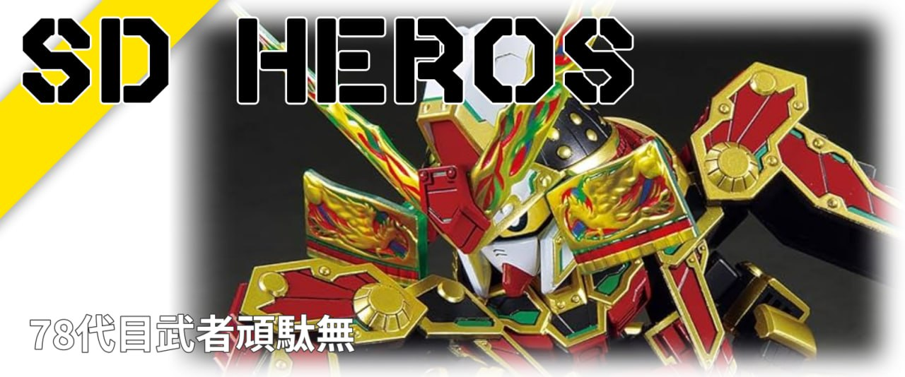
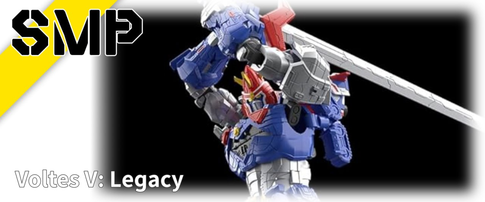
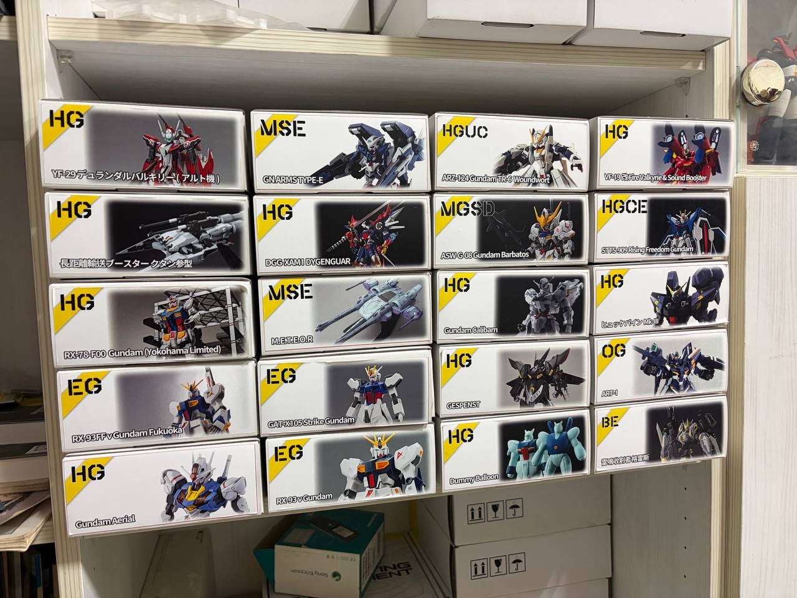

# Bee ModelBox Maker

## 專案簡介
**Bee ModelBox Maker** 是一個基於 Python 與 PyQt6 開發的桌面應用程式，專門為鋼彈模型愛好者設計。它能自動搜尋模型盒繪，並生成符合標準比例的紙盒側邊標籤，支援自定義系列名稱（如 RG, MG）與型號，並提供即時預覽與調整功能。

## 操作介面 (App Interface)

## 實際產生範例 (Sample Output)

*印出來後貼在模型盒子側邊的實際展示效果*

## 最新功能
- **免設定開箱即用**：新增 DuckDuckGo 免費爬蟲搜尋引擎，免填 API Key 也能直接搜圖！
- 自動記憶上一次搜尋的系列與模型名稱
- 可根據搜尋結果或是自行指定的本地圖片來生成模型紙盒標籤

## 核心架構
- **開發語言**：Python 3.14+
- **UI 框架**：PyQt6 (GraphicsView 繪圖引擎)
- **搜尋引擎**：支援免金鑰 DuckDuckGo 搜尋，並可透過 Serper.dev (Google Search API) 取得進階高品質圖片
- **字體引擎**：支援 Iori (裝飾字) 與 ChironHeiHK (標準黑體)
- **畫布尺寸**：1583 x 661 (標準輸出比例)

## 檔案結構
- `main.py`：主程式邏輯與 UI 實作。
- `assets/`：存放 UI 貼圖 (`label.png`) 與字體檔案 (`.otf`, `.ttf`)。
- `PROJECT_LOG.md`：開發進度追蹤與備忘錄。
- `config.json`：存放 API Key 與個人化設定（自動建立於用戶目錄）。

## 關鍵流程
1. **輸入資訊**：輸入系列（如：MG）與型號（如：Zeta Gundam）。
2. **圖片搜尋**：透過 Serper API 檢索高品質盒繪圖片。
3. **本地圖片**：除了網路搜尋外，亦可自行指定盒繪圖片。
4. **即時編輯**：支援滾輪縮放與拖曳圖片位置，背景自動渲染標籤遮罩。
5. **輸出成品**：生成 `系列-模型.png` 並導出至下載資料夾。

## 安全性與去敏感化說明
- 專案已移除所有硬編碼的 API Key。
- 敏感設定（如 Serper Key）統一由用戶透過 UI 齒輪圖示輸入，並加密/本地化儲存於 `~/.Bee_ModelBox_Config.json`。
- 上傳至 GitHub 時，`.json` 設定檔應加入 `.gitignore`。

---
## 字體授權聲明 (Font License Notice)
本專案中使用的部分字體為開放授權字體，其版權歸原作者所有。詳細資訊如下：

1. Iori
原作者： Neale Davidson (Pixel Sagas)
授權範圍： 免費個人及商業使用 (Free for personal and commercial use)
官方網站： Pixel Sagas Official Website

2. 昭源黑體 (Chiron Hei HK)
開發者： Connor (MvSinner)
授權協議： SIL Open Font License (OFL) 1.1
官方專案頁面： Chiron Hei HK on GitHub
Note: 所有字體均依其原始授權條款使用，本專案不擁有上述字體之版權。
